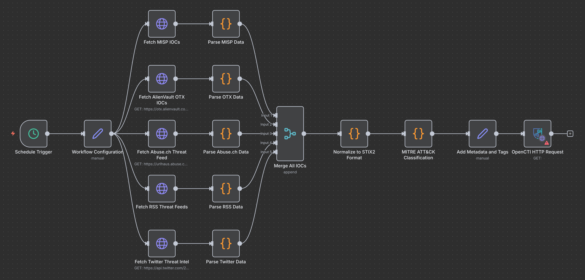

# Ingestion workflow

This workflow is made to gather and ingest IOC into OpenCTI.

It runs every 6 hours and:
* Collects IOCs from MISP, AlienVault OTX, Abuse.ch URLhaus, RSS feeds, and Twitter
* Parses each source to extract indicators (IPs, domains, URLs, hashes, CVEs)
* Merges all IOCs into a unified stream
* Normalizes data into STIX2 format for interoperability
* Classifies threats using MITRE ATT&CK framework (tactics and techniques)
* Adds metadata including ingestion timestamp, confidence scores, and TLP levels

## How to Setup

Import the json file on your n8n instance.

MISP API endpoint URL: Configure your MISP server endpoint in the Workflow Configuration node
MISP API key: Add your MISP authentication key
AlienVault OTX API key: Get your API key from AlienVault OTX platform
RSS threat feed URL: Specify the RSS feed URL for threat intelligence (e.g., US-CERT, SANS ISC)
Twitter API bearer token: Configure Twitter API v2 bearer token for threat intel monitoring

## TO DO
* [ ] Add all TTPs
* [ ] Add an AI classifier